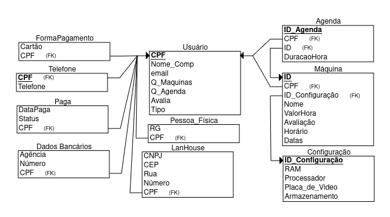

# FEI - Projeto Banco de Dados

Projeto de modelagem de um banco de dados utilizando projeto de Arquitetura de Software

## Objetivo do Sistema
Nosso principal objetivo é simplificar o acesso do público a computadores de alto desempenho, atuando como intermediários entre clientes e fornecedores. Através da nossa plataforma, os usuários podem facilmente agendar um horário disponível e acessar remotamente um computador devidamente registrado. Isso possibilita que eles executem suas tarefas com o máximo de conveniência e conforto possível. Veja mais sobre a arquitetura do software no [link](https://github.com/rodoraciotto/NebulaTech/wiki)

<details>
    <summary><h2>Principais Funcionalidades:</h2></summary>

    

- Cadastro de usuário, sendo dividido em cliente e fornecedor da máquina
- Cadastro de máquinas, feita pelo fornecedor, podendo ser pessoa física ou
Lan House
- Agendamento das máquinas, apresentando as datas disponíveis para
locação
- Alteração da configuração e de disponibilidade da máquina
- Validação dos dados do usuário, máquina e fornecedor
- Avaliação do cliente e da máquina
- Pagamento da máquina alugada
</details>

<details>
    <summary><h2>Lógica de Modelagem:</summary>

- O Usuário tem em comum Nome Completo, e-mail, telefone e CPF; eles
podem ser Cliente ou Fornecedor.
- Os Clientes têm em comum a avaliação, forma de pagamento e
agendamentos, só eles conseguem fazer agendamentos.
- Os Fornecedores compartilham Dados bancários e quantidades de
máquinas cadastradas(Q_Máquinas), elas podem ser divididas entre
Pessoa Física, contendo RG, ou uma LanHouse, contendo CNPJ e
endereço.•
Os Clientes conseguem agendar máquinas para serem usadas, de acordo
com o ValorHora, disponibilidade ou hardware da máquina;
- A máquina cadastrada tem um ID, nome, valor do agendamento
(ValorHora), disponibilidade e avaliação de usuários.
- Os Fornecedores Cadastram as máquinas para disponibilizá-las com base
na configuração do hardware, como Armazenamento, Placa_de_vídeo,
Processador, RAM e toda configuração de Máquina também tem seu
ID_Configuração.
- Os Clientes fazem as solicitações e agendamentos por meio do serviço
NebulaTech, nós enviamos todos os dados necessários para o Fornecedor,
e após todas as aprovações necessárias, tanto o Fornecedor quanto a
NebulaTech, recebem o pagamento.
- Após o serviço, os clientes conseguem avaliar a máquina utilizada. Os
Clientes conseguem solicitar a edição do agendamento da máquina
escolhida, porém esse processo envolve mandar uma notificação para o
fornecedor aprovar o pedido.
</details>

<details>
    <summary><h2>Diagrama Entidade Relacionamento</h2></summary>


</details>

<details>
    <summary><h2>Adaptação e Explicação do Esquema Relacional:</h2></summary>

Adicionamos o atributo de duração no relacionamento da agenda, assim podemos organizar de forma mais efetiva os dados para o funcionamento do negócio

1) Aplicamos inicialmente a distinção e mapeamento das entidades, decidimos então dividi-las em: Usuário, Cliente, Fornecedor, Máquina, Pessoa_Física, LanHouse. Escolhemos pois a partir do esquema dividimos que esses são os pilares para o nosso
modelo de negócio e que a estruturação do banco tornando-os entidades traria robustez
e segurança ao nosso modelo de negócio e organização dos dados
2) A partir de então começamos a levantar os atributos que comporão tais entidades e
realizar o mapeamento dos atributos multivalorados, que foram: telefone, FormaPagamento, Dados Bancários.
3) Dada tal organização começamos a distinguir os tipos de relacionamentos que compunham nossas entidades, levando em conta as regras nos atentamos principalmente em organizar de forma correta os relacionamentos 1:N 1:N (Máquina tem cpf Forn e Id conf) e M:N (tabela paga com cpf cliente e fornecedor, tabela agenda com cpf do cliente e id da Máquina)

Regra de especialização:
- Percebemos que seria vital para a estrutura do projeto organizar o utilizadores do
negócio em dois: Cliente e Fornecedor. Levando a estruturação do nosso banco a uma
relação de subclasse e superclasse. Usuário possuí um atributo tipo para identificar se ele é cliente, Lan house ou Pessoa Física (Fornecedor)

</details>


<details>
    <summary><h2> Esquema Relacional</h2></summary>



</details>


<details>
    <summary><h2>Exemplo de Query</h2></summary>
    A consulta será: 


``` 
Apresentar a média de alocação por hora realizada nos últimos 6 meses. Agrupar por total de horas, tipo de fornecedor e processador
``` 

Utilizando o arquivo "projeto.sql" foram inseridos dados necessários para a query, Sendo assim a Query formada fica:

```
select c.processador, Sum(a.duracao) as totalHoras, u.tipo
from projeto.agenda as a
left join projeto.máquina as m on m.id = a.idm
left join projeto.configura as c on c.id_config = m.config_id
left join projeto.usuários as u on u.cpf = m.cpfu
where m.datas >= '2023-06-01'
group by c.processador, u.tipo
```

</details>


## Integrantes

| |  |  |
|:----------------:|:----------------:|:----------------:|
| [Gabriel de Souza Scopel](https://github.com/Gabriel-Scopel) | [Murilo Carvalho Povoa](https://github.com/Inf1nity21) | [Rodrigo Moreira Doraciotto](https://github.com/rodoraciotto) |
